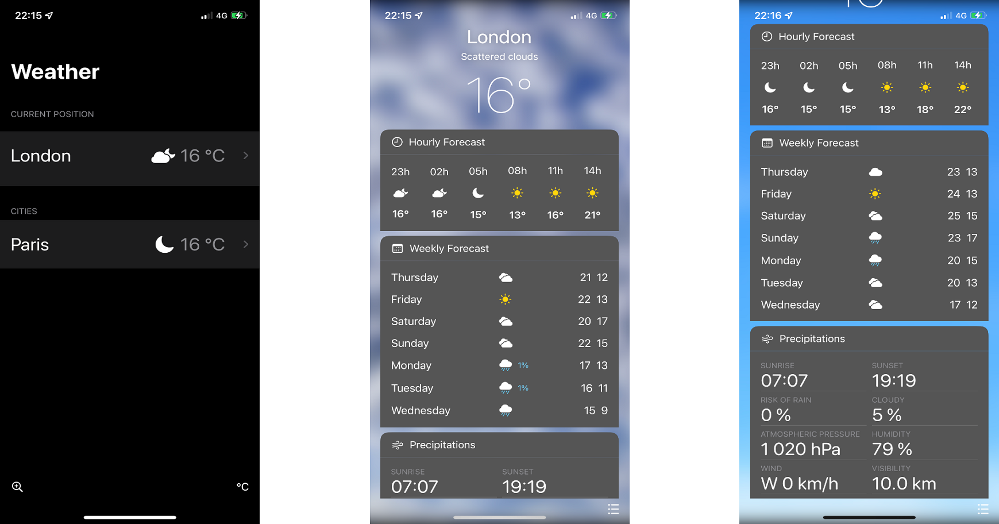

## **What's the Weather App**

**Quel est le but de cette application ?**
What's the Weather est une application permettant d’afficher la météo détaillée en fonction des coordonnées géographiques de votre mobile ainsi qu’en fonction d’autres paramètres.
 
 **Installation du projet** 
 - Installation de XCode
 - Création du nouveau projet (Single View App)

**Avec quelles technologies ?**
Le projet est une application mobile pour IOS nous avons donc travaillé avec SwiftUI. Nous nous sommes aidés de la librairie Alamofire pour réaliser nos requêtes vers l'API.

**Open Weather Map**
Notre application utilise l'API Open Weather Map afin de récupérer les données concernant la météo. Afin d'utiliser l'API il a été nécessaire de se créer un compte pour générer gratuitement la clé API.

**API Google Places**
Pour pouvoir consulter la météo d'autres villes il a fallu utiliser l’API Places mise à disposition par google gratuitement.
Cette API sert majoritairement à l'autocompletion de la barre de recherche des villes.
Comme pour OpenWeatherMap, pour utiliser l'API il a fallu récupérer une clé API.